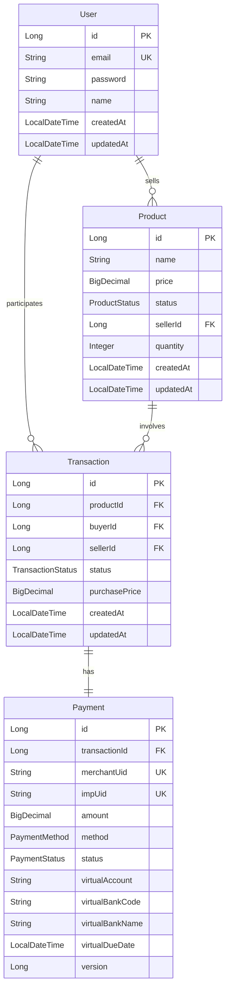

# Wanted Market API

## 프로젝트 소개

Wanted Market은 사용자간 거래가 가능한 온라인 마켓플레이스 API입니다. 이 프로젝트는 실제 프로덕션 환경에서 발생할 수 있는 다양한 기술적 과제들을 고려하여 설계되었습니다.

## 기술 스택

### Backend Framework & Libraries

- Java 17
- Spring Boot 3.4.0
- Spring Security + JWT (0.12.6)
- Spring Data JPA
- Spring Validation
- Spring Docker Compose
- Lombok

### Database

- MySQL
- H2 (테스트용)

### Documentation

- SpringDoc OpenAPI (Swagger) 2.7.0

## 주요 기능

### 1. 사용자 기능 (User)

- 회원가입 및 로그인 (JWT 기반 인증)
- 사용자 프로필 관리
- 구매/판매 이력 조회

### 2. 상품 관리 (Product)

- 상품 등록/수정/삭제 (회원 전용)
- 상품 목록 및 상세 조회 (비회원 가능)
- 실시간 재고 관리
- 상품 상태 관리 (판매중/예약중/완료)

### 3. 거래 기능 (Transaction)

- 상품 구매 요청
- 거래 상태 관리 (요청/승인/확정/완료)
- 거래 이력 조회
- 구매 시점 가격 보존

### 4. 결제 시스템 (Payment)

- 가상계좌 기반 결제
- PG사(포트원) 연동
- 결제 상태 관리
- 결제 취소 처리

## 실행 방법

### 요구사항

- Java 17
- Docker

### 데이터베이스 실행

```bash
docker-compose up -d
```

### 애플리케이션 실행

```bash
./gradlew bootRun
```

## API Documentation

API 문서는 [여기](https://doxxx-playground.github.io/wanted-preonboarding-challenge-backend-26)에서 확인하실 수 있습니다.

- [OpenAPI Specification (JSON)](docs/api/openapi.json)

### 주요 API 엔드포인트

#### 사용자 API

- `POST /api/users/signup` - 회원가입
- `POST /api/users/login` - 로그인

#### 상품 API

- `GET /api/products` - 상품 목록 조회
- `POST /api/products` - 상품 등록

#### 거래 API

- `POST /api/transactions` - 거래 생성
- `PATCH /api/transactions/{id}/status` - 거래 상태 변경

#### 결제 API

- `POST /api/payments` - 결제 생성 (가상계좌 발급)
- `PATCH /api/payments/{merchant_uid}/confirm` - 결제 확인
- `POST /api/payments/{merchant_uid}/cancel` - 결제 취소

## 테스트

```bash
./gradlew test
```

- Repository 레이어 테스트 구현 완료
- JUnit 5 기반 테스트
- H2 인메모리 데이터베이스 사용

## 개발 로그

자세한 개발 과정과 의사결정은 [DEVELOPMENT_LOG.md](docs/DEVELOPMENT_LOG.md)를 참고해주세요.

## 요구사항

프로젝트의 상세 요구사항은 [REQUIREMENTS.md](docs/REQUIREMENTS.md)에서 확인하실 수 있습니다.

# 원티드 프리온보딩 챌린지 백엔드 사전과제

## 개발 로그

프로젝트 진행 상황과 의사결정 과정은 [DEVELOPMENT_LOG.md](docs/DEVELOPMENT_LOG.md)에서 확인하실 수 있습니다.

## 요구사항

프로젝트의 요구사항은 [REQUIREMENTS.md](docs/REQUIREMENTS.md)에서 확인하실 수 있습니다.

## TODO 목록

프로젝트의 TODO 목록은 [TODO.md](docs/TODO.md)에서 확인하실 수 있습니다.

## ERD



## 프로젝트 구조

```
src
├── main
│   ├── java
│   │   └── com
│   │       └── wanted
│   │           └── market
│   │               ├── config
│   │               │   ├── security
│   │               │   ├── JpaConfig
│   │               │   ├── RestClientConfig
|   |               |   └── OpenApiConfig
│   │               ├── domain
│   │               │   ├── user
│   │               │   ├── product
│   │               │   ├── transaction
│   │               │   └── payment
│   │               └── common
│   └── resources        ├──dto         // 공통 응답 객체
└── test                 └──exception   // 전역 예외 처리
    └── java
```
