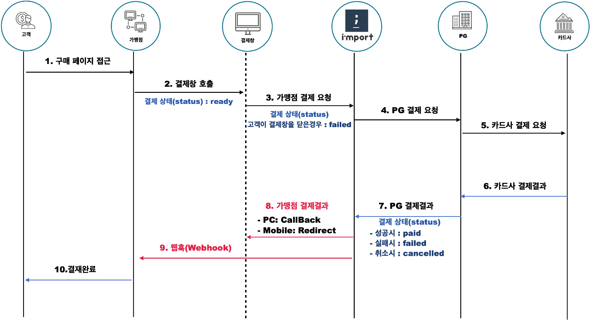

# 개발 로그

## 1. 프로젝트 설계 단계 (2024-12-02)

### 1.1 ERD 설계

첫 번째로 프로젝트의 ERD를 설계했습니다. 주요 엔티티는 다음과 같습니다:


### 1.2 테스트 계획

테스트는 다음과 같은 전략으로 진행할 예정입니다:

1. **커버리지 목표**
    - 전체 코드 커버리지 80% 이상 달성
    - 중요 비즈니스 로직(거래 처리, 결제 등)은 100% 커버리지 목표
    - 도메인 엔티티의 유효성 검증 로직 100% 커버리지

2. **테스트 종류**
    - 단위 테스트
        * 엔티티 유효성 검증
        * 비즈니스 로직 검증
        * Repository 쿼리 테스트
    - 통합 테스트
        * API 엔드포인트 테스트
        * 트랜잭션 처리 테스트
    - 성능 테스트
        * 동시성 테스트 (여러 사용자가 동시에 구매 시도)
        * API 응답 시간 벤치마크

3. **보안 테스트**
    - 인증/인가 테스트
    - 입력값 검증 테스트
    - SQL 인젝션 방지 테스트
    - 패스워드 암호화 검증

## 2. 엔티티 구현 (2024-12-02)

### 2.1 JPA Auditing & Base Entity 구현

JPA Auditing 설정과 Base Entity를 구현했습니다:

1. **JPA Auditing 설정**
    - `@EnableJpaAuditing`으로 Auditing 기능 활성화
    - `AuditorAware<String>` 구현으로 현재 사용자 정보 제공
    - Security Context에서 인증된 사용자 정보 추출
    - 미인증 사용자는 "SYSTEM"으로 기록

2. **BaseTimeEntity 구현**
    - `@MappedSuperclass`로 상속 구조 구현
    - `@EntityListeners(AuditingEntityListener.class)`로 Auditing 이벤트 리스닝
    - createdAt, updatedAt 필드 자동 관리
    - 낙관적 락을 위한 version 필드 추가

3. **BaseEntity 구현**
    - BaseTimeEntity를 상속하여 시간 정보 재사용
    - createdBy, updatedBy 필드로 생성/수정자 정보 관리
    - 모든 필드에 적절한 제약조건 추가 (nullable, updatable 등)

### 2.2 User 엔티티 구현

사용자 정보를 저장할 User 엔티티를 구현했습니다:

- 테이블명을 'users'로 지정 (user는 예약어인 경우가 많음)
- email에 unique 제약조건 추가
- 유효성 검증 어노테이션 추가 (@Email, @NotBlank, @Size)
- Builder 패턴 적용
- 비밀번호 암호화는 서비스 레이어에서 처리 예정

### 2.3 Product 엔티티 구현

제품 정보를 저장할 Product 엔티티를 구현했습니다:

- 판매자와 ManyToOne 관계 설정 (fetch = LAZY)
- ProductStatus enum으로 상태 관리 (ON_SALE, RESERVED, COMPLETED)
- 가격은 BigDecimal 사용 (금액 계산의 정확성을 위해)
- quantity는 2단계 요구사항이지만 미리 포함
- 상태 변경과 수량 변경을 위한 메서드 추가
- 인덱스 추가 (상태, 판매자)
- 유효성 검증 로직 추가 (가격, 수량)

### 2.4 Transaction 엔티티 구현

거래 정보를 저장할 Transaction 엔티티를 구현했습니다:

- 제품, 구매자, 판매자와 ManyToOne 관계 설정 (fetch = LAZY)
- TransactionStatus enum으로 상태 관리 (REQUESTED, APPROVED, CONFIRMED, COMPLETED)
- purchasePrice 필드로 구매 시점의 가격 저장 (가격 변동에 대응)
- 구매자/판매자 확인을 위한 유틸리티 메서드 추가
- 입력값 검증 로직 추가 (가격, 참여자)
- null 체크 추가로 안정성 향상
- 인덱스 추가 (상품, 구매자, 판매자, 상태)

## 3. Repository 계층 구현 (2024-12-02)

### 3.1 공통 구현 사항

모든 Repository에 대해 다음 사항을 공통으로 적용했습니다:

- JpaRepository 상속으로 기본 CRUD 연산 지원
- 메서드 명명 규칙을 준수하여 직관적인 인터페이스 제공
- 페이징 처리가 필요한 조회 메서드는 Pageable 파라미터 지원
- 적절한 인덱스 활용으로 쿼리 성능 최적화

### 3.2 ProductRepository 구현

상품 관리를 위한 Repository를 구현했습니다:

- 동시성 제어를 위한 낙관적/비관적 락 구현
    * 재고 관리를 위한 Pessimistic Write Lock
    * 일반 업데이트를 위한 Optimistic Lock
- 상품 검색 기능 구현
    * 상태별 검색
    * 판매자별 검색
    * 상품명 부분 일치 검색
- 재고 관리를 위한 쿼리 메서드 추가
- 판매 가능한 상품 조회 기능 구현

### 3.3 TransactionRepository 구현

거래 관리를 위한 Repository를 구현했습니다:

- 거래 이력 조회 기능 구현
    * 구매자별 조회
    * 판매자별 조회
    * 상품별 조회
- 거래 상태 관리 기능
    * 진행 중인 거래 확인
    * 특정 상태의 거래 조회
- 자동화된 거래 관리 지원
    * 오래된 거래 조회
    * 거래 상태별 통계

### 3.4 UserRepository 구현

사용자 관리를 위한 Repository를 구현했습니다:

- 이메일 기반 사용자 조회
- 회원가입 시 이메일 중복 체크
- 사용자 통계 기능 구현
    * 특정 기간 이후 가입자 수 집계
- 비밀번호 찾기 기능 지원

## 4. Service 계층 & 예외 처리 구현 (2024-12-02)

### 4.1 예외 처리 구조 구현

애플리케이션 전반의 예외 처리를 위한 구조를 구현했습니다:

1. **기본 구조**
    - CustomException: 애플리케이션 전반의 기본 예외 클래스
    - ErrorCode: 에러 코드와 메시지를 관리하는 enum
    - ValidationError: 입력값 검증 실패 정보를 담는 record

2. **GlobalExceptionHandler 구현**
    - @RestControllerAdvice를 통한 전역 예외 처리
    - 일관된 예외 응답 형식 제공
    - 비즈니스 예외와 검증 예외의 분리 처리
    - 로깅 전략 구현

3. **응답 형식 표준화**
    - ResponseDto를 통한 일관된 응답 형식
    - 성공/실패 여부 명확히 구분
    - 메시지와 데이터 분리

### 4.2 User 서비스 구현

사용자 관리를 위한 서비스 계층을 구현했습니다:

1. **주요 기능**
    - 사용자 생성
    - 사용자 조회
    - 사용자 삭제

2. **검증 로직**
    - Spring Validation을 활용한 입력값 검증
    - 이메일 중복 체크
    - 비즈니스 규칙 검증

3. **트랜잭션 관리**
    - @Transactional 어노테이션을 통한 트랜잭션 관리
    - 읽기 전용 트랜잭션 최적화

### 4.3 Product 서비스 구현

상품 관리를 위한 서비스 계층을 구현했습니다:

1. **핵심 기능**
    - 상품 등록/수정/삭제
    - 상품 조회 (단일/목록)
    - 상품 검색
    - 재고 관리
    - 판매자별 상품 관리

2. **동시성 제어**
    - 재고 관리에 pessimistic lock 적용
    - 상품 정보 수정에 optimistic lock 적용
    - 재고 변경의 원자성 보장

3. **검증 로직**
    - Spring Validation을 활용한 입력값 검증
    - 상품 상태 및 재고 검증
    - 판매자 권한 검증

4. **트랜잭션 관리**
    - 기본적으로 readOnly 트랜잭션 사용
    - 상태 변경 작업에 쓰기 트랜잭션 적용
    - 재고 관리의 격리 수준 관리

5. **비즈니스 규칙**
    - 상품 삭제 시 soft delete 처리
    - 재고에 따른 자동 상태 변경
    - 판매자 권한 확인

### 4.4 Transaction 서비스 구현 (2024-12-02)

거래 관리를 위한 서비스 계층을 구현했습니다:

1. **핵심 기능**
    - 거래 생성 (구매 요청)
    - 거래 상태 관리 (승인, 확정, 완료)
    - 거래 조회 (구매/판매 내역)
    - 상품별 거래 내역 조회

2. **거래 상태 관리**
    - REQUESTED → APPROVED → CONFIRMED → COMPLETED 흐름
    - 각 단계별 권한 검증:
        * APPROVED: 판매자만 승인 가능
        * CONFIRMED: 구매자만 확정 가능
        * COMPLETED: 판매자가 최종 완료

3. **구매 프로세스**
    - 구매 시점 가격 기록 (가격 변동 대응)
    - 재고 자동 감소
    - 1인당 1개 구매 제한
    - 수량에 따른 상품 상태 자동 변경

4. **검증 로직**
    - 구매자/판매자 권한 검증
    - 상품 구매 가능 상태 확인
    - 중복 구매 방지
    - 거래 상태 변경 권한 확인

5. **조회 기능**
    - 구매 내역 조회
    - 판매 내역 조회
    - 진행중인 거래 조회
    - 상품별 거래 내역 조회

6. **비즈니스 규칙**
    - 판매자는 자신의 상품을 구매할 수 없음
    - 거래 완료 시 상품 상태 자동 변경
    - 거래 당사자만 거래 내역 조회 가능

### 4.5 도메인 컨텍스트 정의

현재까지 구현된 도메인의 컨텍스트와 제약사항을 명확히 정의했습니다:

1. **User 도메인**
    - 구매자/판매자 역할 통합 관리
    - 사용자 프로필 및 인증 정보 관리
    - 도메인 규칙: 이메일 중복 불가, 비밀번호 검증 등

2. **Product 도메인**
    - 상품 라이프사이클 관리
    - 재고 관리 시스템
    - 도메인 규칙:
        * 음수 재고/가격 불가
        * 판매자만 수정 가능
        * 재고 0 시 자동 상태 변경
        * 구매 가능 조건 정의

3. **기술적 고려사항**
    - 동시성 제어 전략
    - 데이터 일관성 유지 방안
    - 에러 처리 전략

## 5. Controller 계층 구현 (2024-12-02)

### 5.1 공통 구현 사항

모든 컨트롤러에 대해 다음 사항을 공통으로 적용했습니다:

1. **구조적 특징**
    - @RestController와 적절한 @RequestMapping 사용
    - 생성자 주입을 위한 @RequiredArgsConstructor 활용
    - ResponseDto를 통한 일관된 응답 형식 제공

2. **보안 처리**
    - Spring Security의 @AuthenticationPrincipal을 통한 인증 처리
    - 각 엔드포인트별 적절한 인증 요구사항 적용
    - 비회원 접근 가능 엔드포인트 구분

3. **Validation & Error Handling**
    - @Valid를 통한 요청 데이터 검증
    - 적절한 HTTP 상태 코드 반환
    - GlobalExceptionHandler와의 연동

4. **페이징 처리**
    - @PageableDefault를 통한 기본 페이징 설정
    - 정렬 기준 지정 (기본값: 생성일시 DESC)

### 5.2 ProductController 구현

상품 관리를 위한 컨트롤러를 구현했습니다:

1. **엔드포인트 구성**
    - GET /api/products - 상품 목록 조회 (비회원 가능)
    - GET /api/products/{id} - 상품 상세 조회 (비회원 가능)
    - POST /api/products - 상품 등록 (회원만)
    - PUT /api/products/{id} - 상품 수정 (판매자만)

2. **주요 기능**
    - 비회원도 접근 가능한 조회 API 구현
    - 회원 전용 등록/수정 기능 구현
    - 페이징을 통한 대량 데이터 처리

3. **권한 처리**
    - 상품 등록: 로그인한 회원만 가능
    - 상품 수정: 해당 상품의 판매자만 가능
    - 조회: 모든 사용자 가능

### 5.3 TransactionController 구현

거래 관리를 위한 컨트롤러를 구현했습니다:

1. **엔드포인트 구성**
    - POST /api/transactions - 거래 생성 (구매하기)
    - PUT /api/transactions/{id}/status - 거래 상태 변경 (승인/확정)
    - GET /api/transactions/my/purchases - 내 구매 목록
    - GET /api/transactions/my/ongoing - 내 진행중 거래 목록

2. **주요 기능**
    - 구매 프로세스 구현 (구매 요청 → 승인 → 확정)
    - 구매/판매 내역 조회 기능
    - 진행중인 거래 관리

3. **보안 처리**
    - 모든 엔드포인트에 인증 필요
    - 거래 당사자만 상태 변경 가능
    - 자신의 거래 내역만 조회 가능

### 5.4 UserController 구현

사용자 관리를 위한 컨트롤러를 구현했습니다:

1. **엔드포인트 구성**
    - POST /api/users - 회원 가입
    - GET /api/users/me - 내 정보 조회

2. **주요 기능**
    - 회원가입 처리
    - 현재 로그인한 사용자 정보 조회

3. **보안 처리**
    - 회원가입은 모든 사용자 접근 가능
    - 내 정보 조회는 인증된 사용자만 가능

### 5.5 다음 단계 계획

1. **테스트 코드 작성**
    - 각 컨트롤러에 대한 단위 테스트
    - 통합 테스트를 통한 전체 플로우 검증
    - 동시성 테스트로 성능 검증

2. **보안 강화**
    - Spring Security 설정 추가
    - JWT 기반 인증 구현
    - CORS 설정

3. **문서화**
    - Swagger/OpenAPI 문서 작성
    - README 업데이트
    - API 명세서 작성

## 6. API 문서화 및 보안/동시성 개선 (2024-12-02)

### 6.1 OpenAPI(Swagger) 문서화 구현

1. **기본 설정**
    - springdoc-openapi 의존성 추가
    - OpenApiConfig 설정 클래스 구현
    - Swagger UI 및 API docs 경로 설정

2. **API 스펙 인터페이스 분리**
    - 각 컨트롤러에 대한 스펙 인터페이스 생성:
        * ProductControllerSpec
        * TransactionControllerSpec
        * UserControllerSpec
    - 상세한 API 문서화 어노테이션 추가:
        * Operation 설명
        * 파라미터 설명
        * 응답 스키마
        * 에러 케이스

3. **문서화 세부 사항**
    - JWT 인증 요구사항 명시
    - 에러 응답 형식 정의
    - API 그룹핑 및 태그 설정
    - 서버 정보 설정

### 6.2 보안 강화

1. **JWT 인증 구현**
    - JwtTokenProvider 구현:
        * 토큰 생성 및 검증
        * 사용자 인증 정보 추출
    - JwtAuthenticationFilter 구현:
        * 토큰 기반 인증 처리
        * SecurityContext 관리

2. **Security 설정**
    - SecurityConfig 구현:
        * 엔드포인트별 인증 요구사항 설정
        * CSRF 보호
        * 세션 관리 전략
        * 비밀번호 인코딩 설정

3. **보안 관련 설정**
    - JWT 설정 값 외부화 (application.yaml)
    - 토큰 만료 시간 설정
    - 시크릿 키 관리

### 6.3 동시성 제어 개선

1. **낙관적 락(Optimistic Lock) 도입**
    - 주요 엔티티에 @Version 필드 추가:
        * User
        * Product
        * Transaction
    - 충돌 감지 및 처리 구현

2. **Repository 개선**
    - Lock 관련 쿼리 명시적 정의
    - @Query 어노테이션을 통한 락 전략 구체화
    - 낙관적/비관적 락 조합 활용

3. **동시성 전략**
    - 재고 관리: 비관적 락 활용
    - 일반 업데이트: 낙관적 락 활용
    - 성능과 데이터 정합성의 균형 고려

### 6.4 설정 관리 개선

1. **YAML 기반 설정**
    - properties에서 YAML로 마이그레이션
    - 구조화된 설정 관리:
        * 애플리케이션 설정
        * JPA 설정
        * JWT 설정
        * 로깅 설정
        * OpenAPI 설정

2. **환경별 설정 분리 준비**
    - 개발/운영 환경 분리 구조 마련
    - 설정 값의 외부화 고려

시작 부분에 다음 내용을 추가하고 내용을 이어가면 될 것 같습니다:

## 7. JWT 기반 인증 구현 (2024-12-02)

### 7.1 JWT 인증 시스템 구현

1. **SecurityConfig 변경**
    - JWT 토큰 기반 인증으로 전환
    - 이메일 기반 인증 로직 구현
    - 멤버 전용 API 인증 체크 추가
    - 판매자/구매자 권한 검증 추가

2. **인증 실패 에러코드 추가**
    - 토큰 관련 에러
    - 권한 검증 실패
    - 인증 실패

3. **토큰 검증/생성 로직 개선**
    - 토큰 검증 강화
    - 생성 로직 보안 향상

## 8. 테스트 코드 작성 (2024-12-03)

### 8.1 테스트 기반 구조 설정

1. **테스트 환경 설정**
    - JpaConfig 테스트용 분리
    - AuditorAware 구현체 추가
    - H2 인메모리 데이터베이스 설정
    - 테스트 프로필 구성

2. **공통 테스트 유틸리티**
    - 테스트 데이터 빌더 패턴 적용
    - 반복되는 설정의 추상화
    - 테스트 격리를 위한 트랜잭션 관리

### 8.2 Repository 테스트 구현

1. **ProductRepository 테스트**
    - 기본 CRUD 테스트
    - 동시성 제어 테스트 (낙관적/비관적 락)
    - 상태별 조회 테스트
    - 검색 기능 테스트

2. **UserRepository 테스트**
    - 회원 가입 테스트
    - 이메일 중복 체크
    - 사용자 조회 테스트
    - 통계 쿼리 테스트

3. **TransactionRepository 테스트**
    - 거래 생성 테스트
    - 상태 변경 흐름 테스트
    - 구매 가격 보존 테스트
    - 조회 기능 테스트

### 8.3 다음 단계 테스트 계획

1. **Service 테스트**
    - 비즈니스 로직 검증
    - 트랜잭션 동작 검증
    - 예외 처리 검증
    - Mock 객체를 활용한 의존성 처리

2. **Controller 테스트**
    - API 엔드포인트 검증
    - 요청/응답 형식 검증
    - 인증/인가 처리 검증
    - 입력값 검증

3. **통합 테스트**
    - E2E 시나리오 테스트
    - 성능/부하 테스트
    - 보안 취약점 테스트

## 9. 결제 시스템 POC (2024-12-03)



### 9.1 결제 연동 분석

1. **결제 흐름 분석**
    - 현재 거래 상태: REQUESTED -> APPROVED -> CONFIRMED -> COMPLETED
    - 결제 프로세스 상태: READY -> PENDING -> PAID -> CANCELLED/FAILED
    - 통합 고려사항:
        * 거래 생성과 결제 시작의 연동
        * 결제 완료와 거래 상태 동기화
        * 결제 실패/취소 시 거래 처리

2. **기술 스택 검토**
    - 현재 시스템:
        * Spring Boot / JPA
        * Spring Security (JWT)
        * MySQL
    - 추가 필요 스택:
        * RestClient (포트원 API 연동)
        * ObjectMapper (JSON 처리)
        * 웹훅 처리를 위한 API 엔드포인트

### 9.2 도메인 설계

1. **Payment 엔티티**

```java

@Entity
@Table(name = "payments")
public class Payment extends BaseEntity {
    @Id
    @GeneratedValue
    private Long id;

    @Column(unique = true)
    private String merchantUid; // 주문번호

    private String impUid;     // 포트원 결제번호

    @OneToOne(fetch = LAZY)
    private Transaction transaction;

    @Enumerated(STRING)
    private PaymentStatus status;

    private BigDecimal amount;

    // 가상계좌 정보
    private String vbankCode;    // 은행코드
    private String vbankNumber;  // 계좌번호
    private String vbankHolder;  // 예금주
    private LocalDateTime vbankExpireAt; // 입금기한
}
```

2. **결제 상태**

```java
public enum PaymentStatus {
    READY,      // 결제 준비
    PENDING,    // 가상계좌 발급
    PAID,       // 결제 완료
    FAILED,     // 결제 실패
    CANCELLED   // 결제 취소
}
```

### 9.3 주요 기술적 과제

1. **트랜잭션 관리**
    - 결제-거래 상태 동기화
    - 동시성 제어 (낙관적 락 활용)
    - 결제 실패 시 롤백 처리

2. **가상계좌 처리**
    - 발급/입금 웹훅 처리
    - 입금 기한 관리
    - 미입금 취소 처리

3. **결제 검증**
    - 금액 일치 검증
    - 주문번호 검증
    - 위변조 방지

### 9.4 구현 계획

1. **Phase 1: 기본 결제 연동**
    - Payment 도메인 구현
    - 포트원 API 클라이언트 구현
    - 가상계좌 발급 프로세스

2. **Phase 2: 웹훅 처리**
    - 웹훅 엔드포인트 구현
    - 결제 상태 동기화
    - 결제 검증 로직

3. **Phase 3: 결제 취소**
    - 결제 취소 API 연동
    - 거래 상태 처리
    - 환불 정책 구현

## 10. 결제 시스템 구현 (2024-12-04)

### 10.1 결제 시스템 설계

기존의 거래 시스템을 기반으로 포트원 결제 시스템을 추가했습니다. 실제 결제가 이루어지는 것을 가정하고 Mock 구현을 진행했습니다.

1. **Payment 도메인 구현**
    - Payment 엔티티
    - PaymentStatus enum
    - PaymentMethod enum
    - 가상계좌 관련 필드 추가

2. **결제 상태 관리**
    ```java
    public enum PaymentStatus {
        READY,          // 결제 준비 상태
        PENDING,        // 가상계좌 발급됨
        PAID,           // 결제 완료
        FAILED,         // 결제 실패
        CANCELLED,      // 결제 취소됨
        REFUNDED        // 환불 완료
    }
    ```

3. **Mock PG 연동**
    - MockPortOneApiService 구현
    - 가상계좌 발급 시뮬레이션
    - 결제 검증 로직 Mock 구현
    - 결제 취소 처리 Mock 구현

### 10.2 인프라 개선

1. **RestClient 도입**
    - Spring 6의 RestClient 사용
    - RestTemplate 대체
    - HTTP 인터페이스 클라이언트 지원

2. **설정 관리**
    ```java
    @Configuration
    public class RestClientConfig {
        @Bean
        public RestClient portOneRestClient() {
            return RestClient.builder()
                .baseUrl("https://api.portone.io/v1")
                .defaultHeader("Content-Type", "application/json")
                .build();
        }
    }
    ```

### 10.3 주요 기능 구현

1. **결제 생성 및 가상계좌 발급**
    ```java
    @Transactional
    public Payment createPayment(Transaction transaction) {
        String merchantUid = generateMerchantUid();
        
        Payment payment = Payment.builder()
            .transaction(transaction)
            .merchantUid(merchantUid)
            .amount(transaction.getPurchasePrice())
            .build();

        return paymentRepository.save(payment);
    }
    ```

2. **결제 상태 관리**
    - READY → PENDING: 가상계좌 발급 시
    - PENDING → PAID: 입금 완료 시
    - PAID → CANCELLED: 결제 취소 시

3. **동시성 제어**
    - 낙관적 락(@Version) 도입
    - 결제 상태 변경 시 충돌 방지

### 10.4 고려한 핵심 요소들

1. **결제 안정성**
    - 중복 결제 방지
    - 결제 금액 검증
    - 결제 상태 추적

2. **에러 처리**
    - 결제 실패 시 거래 상태 처리
    - 검증 실패 시 예외 처리
    - 상태 변경 예외 관리

3. **확장성**
    - 실제 PG사 연동을 고려한 구조
    - 다양한 결제 수단 추가 가능
    - 웹훅 처리를 위한 준비

### 10.5 테스트 코드 개선

1. **테스트 Fixture 패턴 도입**
    ```java
    public static class PaymentBuilder {
        private Transaction transaction;
        private PaymentStatus status = PaymentStatus.READY;
        // ... 필드들
        
        public PaymentBuilder withVirtualAccount() {
            this.virtualAccount = "0123456789";
            this.status = PaymentStatus.PENDING;
            // ... 가상계좌 정보 설정
            return this;
        }

        public PaymentBuilder withConfirmedPayment() {
            withVirtualAccount();
            this.impUid = "imp_" + TestFixture.nextId();
            this.status = PaymentStatus.PAID;
            return this;
        }
        // ... 다른 builder 메서드들
    }
    ```

2. **상태 변화 테스트 강화**
    - READY → PENDING: 가상계좌 발급 검증
    - PENDING → PAID: 결제 완료 검증
    - PAID → CANCELLED: 취소 처리 검증
    - 잘못된 상태 변경 시도에 대한 예외 검증

3. **Mock 응답 처리 개선**
    - PG사 API 응답 시뮬레이션
    - 결제 검증 실패 케이스 처리
    - Repository save 결과값 처리

4. **테스트 가독성 향상**
    - BDD 스타일 테스트 구조화
    - 명확한 테스트 시나리오 기술
    - 상태 변화를 명시적으로 표현

5. **테스트 격리성 강화**
    - 테스트 데이터 생성 로직 중앙화
    - ID 생성 방식 일원화
    - ReflectionTestUtils를 통한 안전한 상태 주입

### 10.6 다음 개선 계획

1. **테스트 커버리지 확대**
    - 엣지 케이스 테스트 추가
    - 동시성 관련 테스트 보강
    - 통합 테스트 시나리오 확대

2. **결제 시스템 보완**
    - 결제 실패 복구 메커니즘
    - 결제 타임아웃 처리
    - 결제 이력 관리 기능
