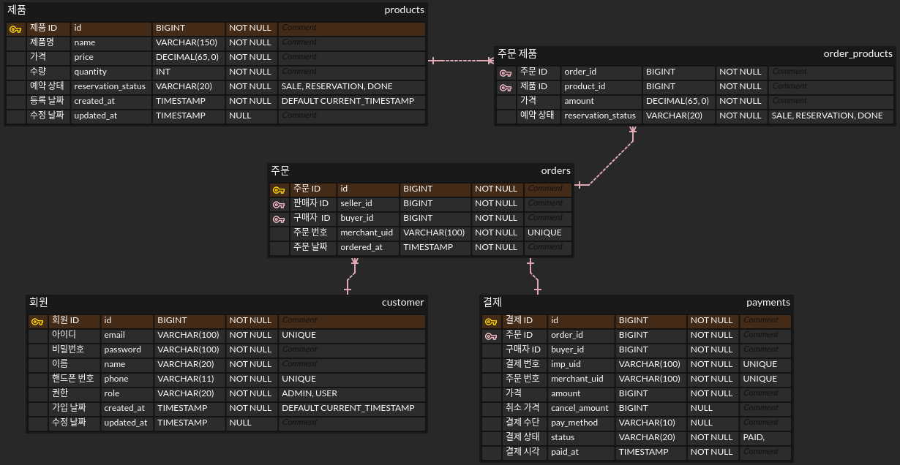

# 원티드 프리온보딩 챌린지 백엔드 26 사전과제
현 스프린트에서 결제 플랫폼, 포트원(구 아임포트)을 사용해서 결제 프로세스를 구현  
이전 스프린트를 진행하지 않았기 때문에 결제진행, 결제취소, 계좌이체 이 세가지 기능만을 구현

### Wanted Market 테이블 구성

### 요구사항
- 결제 인증 전 주문 데이터를 저장
  - 결제 검증을 위해 결제 인증 전에 주문 데이터를 저장해 놓는다
- 주문 번호로 조회할 수 있어야 한다
- 결제를 진행할 수 있어야 한다
  - 결제조회 API로 결제 결과를 검증한다
  - 웹훅을 수신하여 결제를 안정화 한다
    - 컨펌 프로세스를 진행
- 결제를 취소할 수 있어야 한다
- 가상계좌로 결제할 수 있어야 한다
- 결제 실패, 에러 시 에러를 응답으로 내려줘야 한다

#### 고민사항